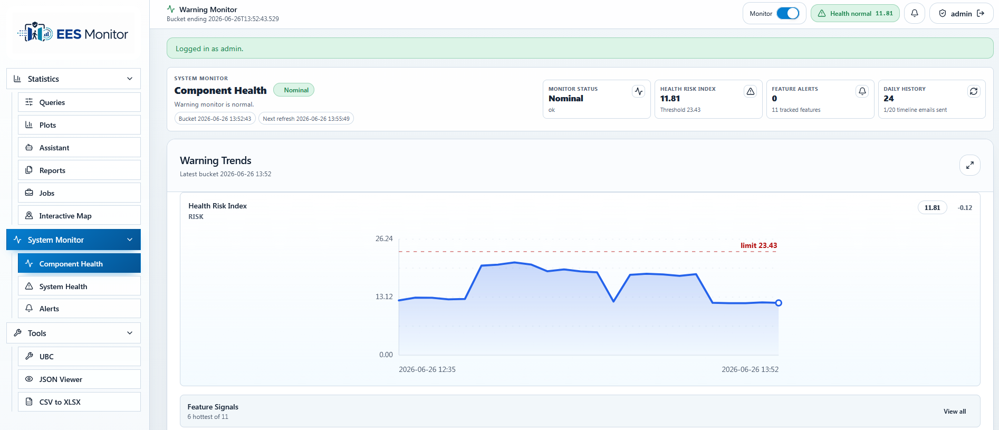
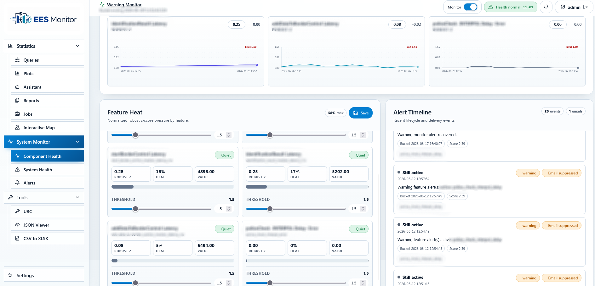
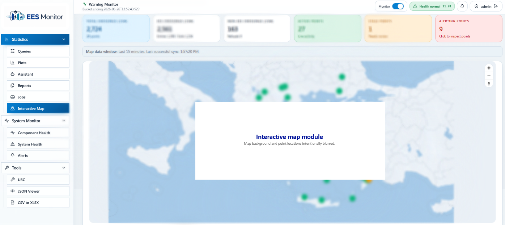
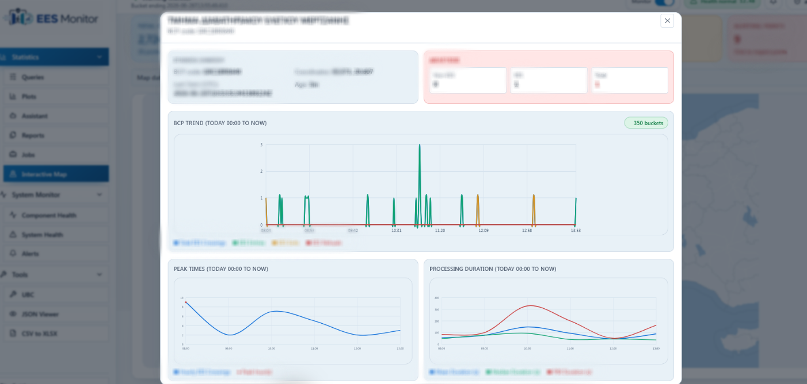
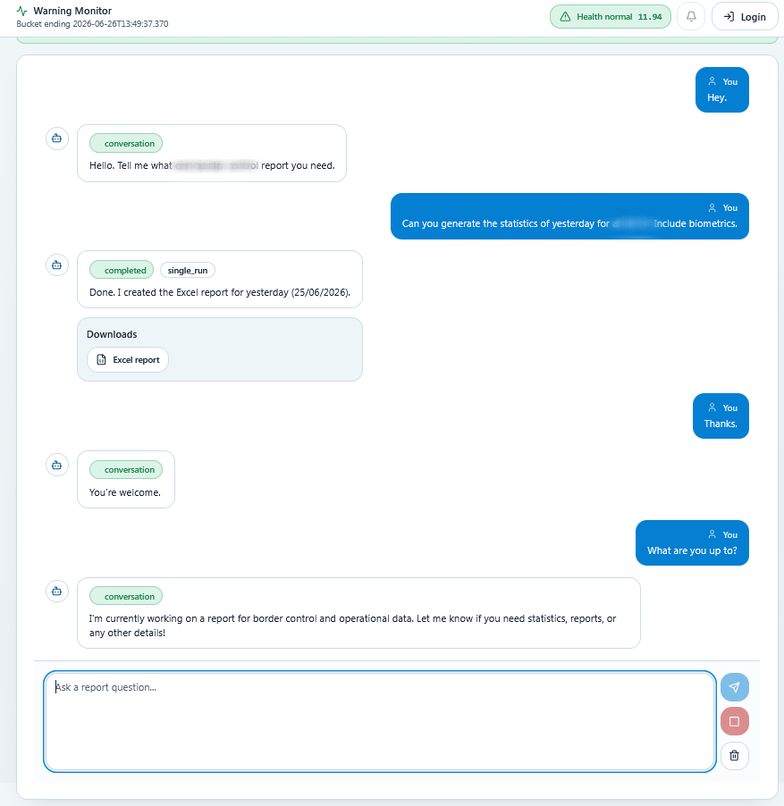
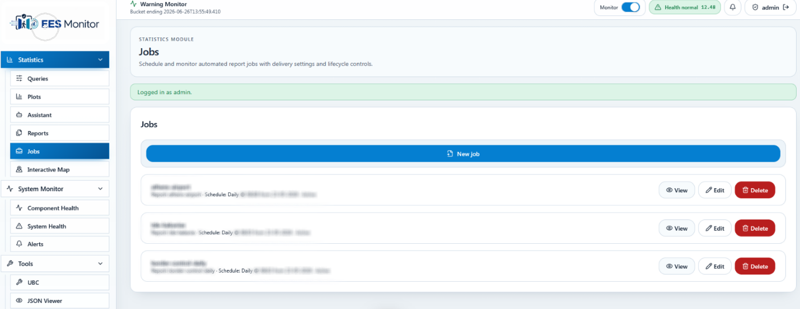

# Operational Monitor

Sanitized public overview of an internal operational analytics and monitoring application.

This repository is intentionally documentation-only. The original project contains sensitive operational logic, internal configuration, production integrations and non-public data, so the source code is not included. The screenshots below are redacted and use generic labels.

## What the project demonstrates

- Operational monitoring dashboard for component and system health
- Feature-level warning scores, thresholds and alert history
- Interactive map view for operational status overview
- Drill-down analytics for alerting points and time-series trends
- Assistant-style workflow for generating report/export packages
- Scheduled jobs interface for automated report delivery
- Report-oriented UI with downloadable artifacts
- Full-stack application design using a frontend, backend reporting service, monitoring layer and deployment workflow

## Screenshots

The screenshots are sanitized: operational identifiers, locations, labels and data values have been blurred or replaced with generic content.

### Component health dashboard

The component health view summarizes monitor status, health-risk index, feature alert counts and recent warning trends.



### Feature heat and alert timeline

The warning monitor combines feature-level pressure indicators, threshold controls and recent alert lifecycle events.



### Interactive map overview

The map view shows a redacted geographic operations layer with status cards and alerting point counts.



### Map point drill-down

Selecting an alerting point opens a detail panel with status metrics and operational trend charts.



### Assistant workflow

The assistant workflow demonstrates conversational report generation and downloadable export artifacts.



### Scheduled report jobs

The jobs interface supports creating, reviewing, editing and deleting automated report schedules.



## High-level architecture

```text
Frontend UI
  |-- statistics workspace
  |-- monitoring dashboards
  |-- assistant workflow
  |-- reports and jobs interface
  |-- interactive map and point drill-downs

Backend services
  |-- report generation API
  |-- monitoring and warning logic
  |-- artifact packaging
  |-- configuration and scheduling layer

Data and outputs
  |-- operational event data source
  |-- generated reports
  |-- charts
  |-- metadata
  |-- export bundles
```

## Why the code is not public

The production project is connected to sensitive internal workflows. Public release of the source code could expose implementation details, operational assumptions, configuration patterns, data fields, alert logic, internal terminology or deployment information.

For that reason, this repository only contains a sanitized overview and redacted screenshots. No production data, credentials, endpoints, queries, internal identifiers, real logs or real exports are included.

## Technologies used in the original project

- Python
- FastAPI-style backend services
- React and TypeScript frontend
- Docker-based deployment
- Elasticsearch-style operational data access
- Automated report generation
- Excel, chart, metadata and ZIP export workflows
- Monitoring and warning dashboards
- Interactive map workflow with point-level drill-downs
- Local assistant workflow for structured report generation
